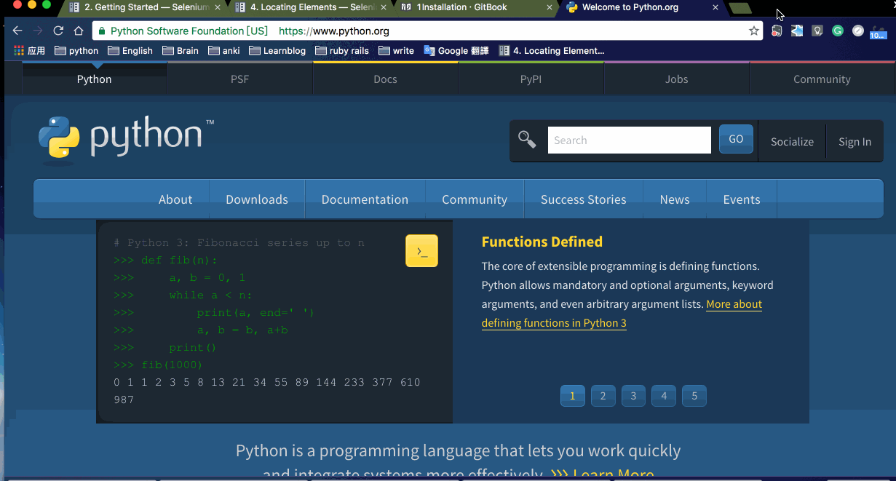

#2.入门教程GettingStarted
##简单的使用Simple Usage
如果有安装了selenium 你就可以开始python编程了
下面是测试浏览器：
google搜索'chromedriver'
driver = webdriver.Chrome('/users/VANXV/downloads/chromedriver')
浏览器是特定的浏览器，后面需要跟上浏览器的物理地址

```python
from selenium import webdriver
from selenium.webdriver.common.keys import Keys
driver = webdriver.Chrome('/users/VANXV/downloads/chromedriver')
driver.get("http://www.python.org")
assert "Python" in driver.title
elem = driver.find_element_by_name("q")
elem.clear()
elem.send_keys("pycon")
elem.send_keys(Keys.RETURN)
assert "No results found." not in driver.page_source
driver.close()
```
##简单的使用Example

```python
from selenium import webdriver
from selenium.webdriver.common.keys import Keys
```

**selenium.webdriver** 模型提供了webdriver启动
当前支持WebDriver启动是Firefox、Chrome、Ie、Remote（远程）、PhantomJS（隐形）
key模块提供了键盘输入，返回，f1,alt等等

下一步：这是创建一个Chrome驱动程序
```python
driver = webdriver.Chrome('/users/VANXV/downloads/chromedriver')
```

```python
driver.get("http://www.python.org")
```
这个driver.get方法将要驾驶一个页面制定的url,
WebDriver将要等待直到这个页面全部载入完毕，（如果失败）返回之前控制您的测试或脚本。
如果AJAX加载过多，WebDriver不能完全加载。

```python
assert "Python" in driver.title
```
这是判断标题里是否有Python关键词,
如果没有就会中断。

webdriver有很多方法找元素find_element_by_* 是一种方法。
例如：这个input text元素能发生定位这个名字的属性使用find_element_by_name方法
详细的说明请看locating Elements章节

```python
elem = driver.find_element_by_name("q")
```
需要测试可以打开google开发工具测一下




下一步我们需要传输关键字，指定关键词能输入，
使用class imported from selenium.webdriver.common.keys
是安全的，我们首先清理所有的填充文字，在这个input区域，因此它不会影响搜索结果

```python
elem.clear()
elem.send_keys("pycon")
elem.send_keys(Keys.RETURN)
```

 submission of the page, you should get the result if there is any. To ensure that some results are found, make an assertion:
 提交页面，确保得到结果，如果有任何，去保证因为一些结果创建，做一个判断
```python
assert "No results found." not in driver.page_source
```
这个我也没弄明白自己研究一下。

关闭浏览器
```
driver.close()
```


##2.3Using Selenium to write tests
使用Selenium写test在这章，我们使用unittest框架，他是一个测试的python.org搜索功能的

```python
import unittest
from selenium import webdriver
from selenium.webdriver.common.keys import Keys

class PythonOrgSearch(unittest.TestCase):

    def setUp(self):
        self.driver = webdriver.Chrome('/users/VANXV/downloads/chromedriver')


    def test_search_in_python_org(self):
        driver = self.driver
        driver.get("http://www.python.org")
        self.assertIn("Python", driver.title)
        elem = driver.find_element_by_name("q")
        elem.send_keys("pycon")
        elem.send_keys(Keys.RETURN)
        assert "No results found." not in driver.page_source


    def tearDown(self):
        self.driver.close()

if __name__ == "__main__":
    unittest.main()
```
返回结果：
```
.
----------------------------------------------------------------------
Ran 1 test in 19.244s

OK
```
unittest是一个测试搜索速度的模块


##使用Selenium远程测试（没写）
http://selenium-python.readthedocs.io/getting-started.html
